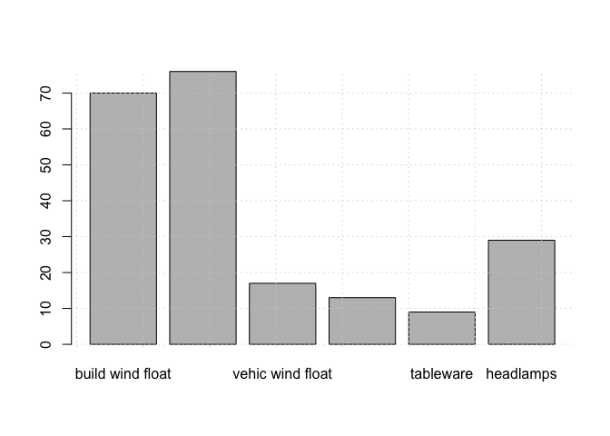

*Remark*: Loading *mlr3* alone will lead to an error, because the learners are not available. A simple solution is to load *mlr3verse* which will load all necessary basic packages of the 'mlr3' family.


```r
library(mlr3verse, quietly = TRUE)
```


## The 'glass' dataset


```r
Glass <- RWeka::read.arff("glass.arff")
str(Glass)
```

```
## 'data.frame':	214 obs. of  10 variables:
##  $ RI  : num  1.52 1.52 1.52 1.51 1.53 ...
##  $ Na  : num  12.8 12.2 13.2 14.4 12.3 ...
##  $ Mg  : num  3.5 3.52 3.48 1.74 0 2.85 3.65 2.84 0 3.9 ...
##  $ Al  : num  1.12 1.35 1.41 1.54 1 1.44 0.65 1.28 2.68 1.3 ...
##  $ Si  : num  73 72.9 72.6 74.5 70.2 ...
##  $ K   : num  0.64 0.57 0.59 0 0.12 0.57 0.06 0.55 0.08 0.55 ...
##  $ Ca  : num  8.77 8.53 8.43 7.59 16.19 ...
##  $ Ba  : num  0 0 0 0 0 0.11 0 0 0.61 0 ...
##  $ Fe  : num  0 0 0 0 0.24 0.22 0 0 0.05 0.28 ...
##  $ Type: Factor w/ 7 levels "build wind float",..: 1 3 1 6 2 2 3 1 7 2 ...
```


```r
barplot(table(Glass$Type))
grid()
```

<!-- -->

## Define a task

First, we have to set up a 'task'. An *mlr3* classification task is given by a name, a data frame, and a nominal, i.e. factor, attribute of the data.

'mlr3' also provides some examples tasks, all known from the many introductions to Machine learning.

```r
as.data.table(mlr_tasks)
```

```
##               key task_type nrow ncol lgl int dbl chr fct ord pxc
## 1: boston_housing      regr  506   19   0   3  13   0   2   0   0
## 2:  german_credit   classif 1000   21   0   0   7   0  12   1   0
## 3:           iris   classif  150    5   0   0   4   0   0   0   0
## 4:         mtcars      regr   32   11   0   0  10   0   0   0   0
## 5:           pima   classif  768    9   0   0   8   0   0   0   0
## 6:          sonar   classif  208   61   0   0  60   0   0   0   0
## 7:           spam   classif 4601   58   0   0  57   0   0   0   0
## 8:           wine   classif  178   14   0   2  11   0   0   0   0
## 9:            zoo   classif  101   17  15   1   0   0   0   0   0
```

```r
# mlr_tasks
```

These tasks can be used to learn and test the functionalities available in 'mlr3'. We can add our own task, classifying the attribute 'Type' in the Glass data.


```r
mytask <- TaskClassif$new(id = "glass",
                          backend = Glass, target = "Type")
mytask
```

```
## <TaskClassif:glass> (214 x 10)
## * Target: Type
## * Properties: multiclass
## * Features (9):
##   - dbl (9): Al, Ba, Ca, Fe, K, Mg, Na, RI, Si
```


## Define a learner

### Naive Bayes

Next, we decide upon a learner for the task, in this case a classification learner, for instance logistic regression, naive Bayes, a decision tree or random forest, etc.

Logistic regression, provided in the *stats* package and available in *mlr3learners* as `classif.log_reg`, is a two-class learner, but our problem is multi-class. We will try one of the simpler learners, 'naive Bayes' from the *e1071* package (This package needs to be installed before.)


```r
learner_nb <- lrn("classif.naive_bayes")
learner_nb
```

```
## <LearnerClassifNaiveBayes:classif.naive_bayes>
## * Model: -
## * Parameters: list()
## * Packages: e1071
## * Predict Type: response
## * Feature types: logical, integer, numeric, factor
## * Properties: multiclass, twoclass
```


### Learning

To generate a fitted model the learner needs to be trained on some data. We split the data set into training and testing data, selecting 10% of the data as test data, the rest is used for training.


```r
n <- nrow(Glass)
itest  <- sample(1:n, 20)
itrain <- setdiff(1:n, itest)
```

Now we can train the model with the training data and display the learned model.


```r
learner_nb$train(mytask, row_ids = itrain)
# learner_nb$model
```

The output will depend on the learner, actually it simply displays what the chosen learner returns.


### Prediction

Predicting the class of new data is done through a call to `learner$predict_newdata()`. To determine the accuracy, it is better to call `learner$predict()`, as this also returns the class of the test data in the original data.


```r
predicts <- learner_nb$predict(mytask, row_ids = itest)
predicts
```

```
## <PredictionClassif> for 20 observations:
##     row_id                truth         response
##         89     build wind float build wind float
##        152     build wind float        tableware
##        154 build wind non-float build wind float
## ---                                             
##         40 build wind non-float        tableware
##         42 build wind non-float build wind float
##         34 build wind non-float vehic wind float
```

It is possible to generate prediction probabilities. We need to tell the learner to include those probobilities.

```r
mylearner <- lrn("classif.naive_bayes", predict_type = "prob")  # "response"
mylearner$train(mytask, row_ids = itrain)
predicts <- mylearner$predict_newdata(Glass[itest, 1:10])
predicts
```

TODO: Find out how to make this work correctly.


### Accuracy

From these predictions we can derive the accuracy with `msr()` resp. `msrs(c(...))`.


```r
a <- predicts$score(msrs(c("classif.acc", "classif.ce")))
a
```

```
## classif.acc  classif.ce 
##        0.25        0.75
```

All possible accuracy measures will be displayed with

```r
# as.data.table(mlr_measures)
mlr_measures
```

```
## <DictionaryMeasure> with 53 stored values
## Keys: classif.acc, classif.auc, classif.bacc, classif.bbrier,
##   classif.ce, classif.costs, classif.dor, classif.fbeta, classif.fdr,
##   classif.fn, classif.fnr, classif.fomr, classif.fp, classif.fpr,
##   classif.logloss, classif.mbrier, classif.mcc, classif.npv,
##   classif.ppv, classif.precision, classif.recall, classif.sensitivity,
##   classif.specificity, classif.tn, classif.tnr, classif.tp,
##   classif.tpr, debug, oob_error, regr.bias, regr.ktau, regr.mae,
##   regr.mape, regr.maxae, regr.medae, regr.medse, regr.mse, regr.msle,
##   regr.pbias, regr.rae, regr.rmse, regr.rmsle, regr.rrse, regr.rse,
##   regr.rsq, regr.sae, regr.smape, regr.srho, regr.sse,
##   selected_features, time_both, time_predict, time_train
```


The confusion matrix is returned from


```r
confusion_matrix <- predicts$confusion
print(confusion_matrix)
```

```
##                       truth
## response               build wind float build wind non-float vehic wind float
##   build wind float                    4                    5                1
##   build wind non-float                2                    0                0
##   vehic wind float                    3                    1                0
##   vehic wind non-float                0                    0                0
##   containers                          0                    0                0
##   tableware                           1                    1                0
##   headlamps                           0                    0                0
##                       truth
## response               vehic wind non-float containers tableware headlamps
##   build wind float                        0          0         0         0
##   build wind non-float                    0          1         0         0
##   vehic wind float                        0          0         0         0
##   vehic wind non-float                    0          0         0         0
##   containers                              0          0         0         0
##   tableware                               0          0         0         0
##   headlamps                               0          0         0         1
```

Obviously, 'naive Bayes' does not a good job in learning this task. We need something better.


## Random Forest

We can repeat the computation with a Random Forest learner such as provided in the *ranger* package by simply replacing the learner option "classif.naive_bayes" with "classif.ranger".

To keep it readable, we repeat all necessary commands. The dataset is the 'glass' dataset as above; the task stays the same. As our data set is not big, the number of subtrees generated should be not greater than 50 (the default is 500). Such arguments are handed over unchanged to the learner function.


```r
# Fix the appropriate Random Forrest learner
learner_rf <- lrn("classif.ranger", num.trees = 50L)

# Start the learner and display the model
learner_rf$train(mytask, row_ids = itrain)
```

```
## Warning: Dropped unused factor level(s) in dependent variable: vehic wind non-
## float.
```

```r
learner_rf$model
```

```
## Ranger result
## 
## Call:
##  ranger::ranger(dependent.variable.name = task$target_names, data = task$data(),      probability = self$predict_type == "prob", case.weights = task$weights$weight,      num.trees = 50L) 
## 
## Type:                             Classification 
## Number of trees:                  50 
## Sample size:                      194 
## Number of independent variables:  9 
## Mtry:                             3 
## Target node size:                 1 
## Variable importance mode:         none 
## Splitrule:                        gini 
## OOB prediction error:             22.16 %
```

```r
# Predict classification on the test set
predicts <- learner_rf$predict(mytask, row_ids = itest)

# Determine the accuracy on the test set
predicts$score(msrs(c("classif.acc", "classif.ce")))
```

```
## classif.acc  classif.ce 
##         0.7         0.3
```

The accuracy is 80% for Random Forrest while it was less than 40 % for 'naive Bayes'.

Of course, calculating the accuracy from one test set is not correct, we need a more reliable approach.

Another score could be the time for training. In our example it is too small to be measured through this approach.


```r
predicts$score(msr("time_train"))
```

```
## time_train 
##          0
```

