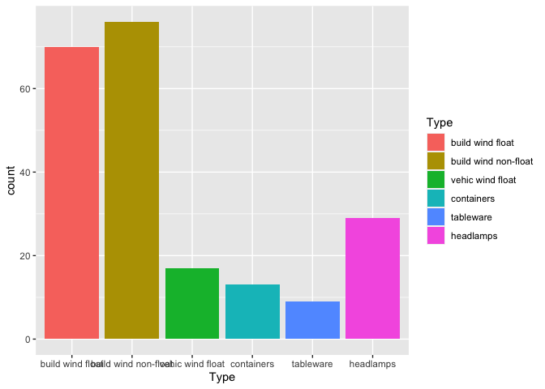

## The Task and the Data

Again we define our data and task as 

```r
Glass <- RWeka::read.arff("glass.arff")
mytask <- TaskClassif$new(id = "glass",
                          backend = Glass, target = "Type")
```

'mlr3' allows for inspecting, changing, and visualizing the task and especially the data through commands.

```r
mytask$nrow; mytask$ncol  # dim(Glass)
```

```
## [1] 214
```

```
## [1] 10
```

```r
mytask$feature_names; mytask$target_names
```

```
## [1] "Al" "Ba" "Ca" "Fe" "K"  "Mg" "Na" "RI" "Si"
```

```
## [1] "Type"
```

We can display the data or a part of it,

```r
mytask$data()  # rows=c(1:10); cols=c("Type", "Al", "Ba")
```

```
##                      Type   Al Ba    Ca   Fe    K   Mg    Na      RI    Si
##   1:     build wind float 1.12  0  8.77 0.00 0.64 3.50 12.79 1.51793 73.03
##   2:     vehic wind float 1.35  0  8.53 0.00 0.57 3.52 12.16 1.51643 72.89
##   3:     build wind float 1.41  0  8.43 0.00 0.59 3.48 13.21 1.51793 72.64
##   4:            tableware 1.54  0  7.59 0.00 0.00 1.74 14.40 1.51299 74.55
##   5: build wind non-float 1.00  0 16.19 0.24 0.12 0.00 12.30 1.53393 70.16
##  ---                                                                      
## 210:     vehic wind float 1.22  0  8.32 0.00 0.59 3.40 13.42 1.51610 72.69
## 211: build wind non-float 2.12  0  7.97 0.00 0.69 3.52 12.86 1.51592 72.66
## 212: build wind non-float 1.25  0  7.94 0.14 0.37 3.52 13.92 1.51613 72.88
## 213: build wind non-float 1.71  0  8.54 0.00 0.73 2.88 12.67 1.51689 73.21
## 214:            tableware 1.66  0  9.32 0.00 0.00 2.19 14.09 1.51852 72.67
```

or show a summary of the data.

```r
summary(as.data.table(mytask))
```

```
##                    Type          Al              Ba              Ca        
##  build wind float    :70   Min.   :0.290   Min.   :0.000   Min.   : 5.430  
##  build wind non-float:76   1st Qu.:1.190   1st Qu.:0.000   1st Qu.: 8.240  
##  vehic wind float    :17   Median :1.360   Median :0.000   Median : 8.600  
##  vehic wind non-float: 0   Mean   :1.445   Mean   :0.175   Mean   : 8.957  
##  containers          :13   3rd Qu.:1.630   3rd Qu.:0.000   3rd Qu.: 9.172  
##  tableware           : 9   Max.   :3.500   Max.   :3.150   Max.   :16.190  
##  headlamps           :29                                                   
##        Fe                K                Mg              Na       
##  Min.   :0.00000   Min.   :0.0000   Min.   :0.000   Min.   :10.73  
##  1st Qu.:0.00000   1st Qu.:0.1225   1st Qu.:2.115   1st Qu.:12.91  
##  Median :0.00000   Median :0.5550   Median :3.480   Median :13.30  
##  Mean   :0.05701   Mean   :0.4971   Mean   :2.685   Mean   :13.41  
##  3rd Qu.:0.10000   3rd Qu.:0.6100   3rd Qu.:3.600   3rd Qu.:13.82  
##  Max.   :0.51000   Max.   :6.2100   Max.   :4.490   Max.   :17.38  
##                                                                    
##        RI              Si       
##  Min.   :1.511   Min.   :69.81  
##  1st Qu.:1.517   1st Qu.:72.28  
##  Median :1.518   Median :72.79  
##  Mean   :1.518   Mean   :72.65  
##  3rd Qu.:1.519   3rd Qu.:73.09  
##  Max.   :1.534   Max.   :75.41  
## 
```


## Selecting and Filtering

We can select (or filter) the data, even with the intention to define a new task to work on. But be carefull: These operations will change the data internally, therefore before doing so we will copy the task object.

```r
mytask_copy <- mytask$clone()

mytask$select(c("Al", "Ba"))  # "Type" not possible
mytask
```

```
## <TaskClassif:glass> (214 x 3)
## * Target: Type
## * Properties: multiclass
## * Features (2):
##   - dbl (2): Al, Ba
```

```r
mytask$filter(c(1:5))
mytask
```

```
## <TaskClassif:glass> (5 x 3)
## * Target: Type
## * Properties: multiclass
## * Features (2):
##   - dbl (2): Al, Ba
```

Note that this changes the original task (in place?), as can be seen from the much reduced sizes.

We can also look at the 'backend' (of the original data).

```r
mytask_copy$backend
```

```
## <DataBackendDataTable> (214x11)
##       RI    Na   Mg   Al    Si    K    Ca   Ba   Fe                 Type
##  1.51793 12.79 3.50 1.12 73.03 0.64  8.77 0.00 0.00     build wind float
##  1.51643 12.16 3.52 1.35 72.89 0.57  8.53 0.00 0.00     vehic wind float
##  1.51793 13.21 3.48 1.41 72.64 0.59  8.43 0.00 0.00     build wind float
##  1.51299 14.40 1.74 1.54 74.55 0.00  7.59 0.00 0.00            tableware
##  1.53393 12.30 0.00 1.00 70.16 0.12 16.19 0.00 0.24 build wind non-float
##  1.51655 12.75 2.85 1.44 73.27 0.57  8.79 0.11 0.22 build wind non-float
##  ..row_id
##         1
##         2
##         3
##         4
##         5
##         6
## [...] (208 rows omitted)
```

We can also extend the data with the `cbind` and `rbind` methods, adding columns or rows to it.

Selecting or filtering will not copy the data, not even internally. Instead the ste of current indices for valid rows and columns is manipulated.


## Plotting Data and Tasks

There are several plotting functions associated with 'mlr3', the simplest one is `autoplot`. We plot the copy from above to get a picture of the full set.

```r
autoplot(mytask_copy)
```

<!-- -->

