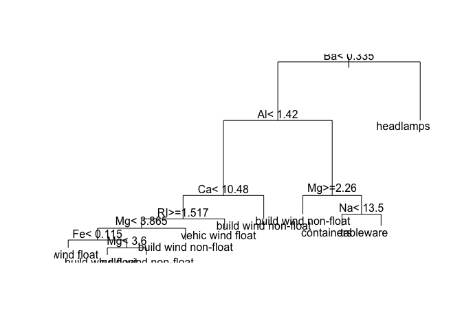

## Data

We will look at how the 'mlr3' package family supports testing of learners. We will use the same data as before.

```r
Glass <- RWeka::read.arff("glass.arff")
dim(Glass)
```

```
## [1] 214  10
```

The task, as defined before, will also be needed.

```r
task <- TaskClassif$new(id = "glass",
                        backend = Glass, target = "Type")
```


## Resampling

*Resampling* is a method to create training and test splits of the data. 'mlr3' supports cross-validation, leave-one-out, bootstrap, and hold-out methods.

To see all resampling methods available in the base 'mlr3' family, display the `mlr_resamplings` dictionary:


```r
as.data.table(mlr_resamplings)
```

```
##            key        params iters
## 1:   bootstrap repeats,ratio    30
## 2:      custom                   0
## 3:          cv         folds    10
## 4:     holdout         ratio     1
## 5:    insample                   1
## 6: repeated_cv repeats,folds   100
## 7: subsampling repeats,ratio    30
```

We will try out the k-fold cross-validation, here given as "cv", doing it k times (with $k^2 models to generate). In the literature the recommended value is $k=10$. We we do a simple 10-fold cross-validation to keep running times small.


### Cross-validation

First we select the resampling strategy.


```r
# resample = mlr_resamplings$get("cv")  # rsmp
resample = rsmp("cv")  # rsmp("cv", folds = 10)
resample
```

```
## <ResamplingCV> with 10 iterations
## * Instantiated: FALSE
## * Parameters: folds=10
```

As learner, let's take this time the classical CART algorithm for classification.


```r
learner <- lrn("classif.rpart")
learner
```

```
## <LearnerClassifRpart:classif.rpart>
## * Model: -
## * Parameters: xval=0
## * Packages: rpart
## * Predict Type: response
## * Feature types: logical, integer, numeric, factor, ordered
## * Properties: importance, missings, multiclass, selected_features,
##   twoclass, weights
```

We will start one learning round and look at the decision tree model, without using and testing data. Instead of printing the model, let's look at the graphical layout of the decision tree.

```r
learner$train(task)
plot(learner$model)
text(learner$model)
```

<!-- -->

To see the the importance of different variables (for this model), call the 'importance' method on this learner.

```r
learner$importance()
```

```
##        Mg        Al        Ca        Ba        RI        Na         K        Si 
## 33.975811 33.389985 29.658069 26.419293 24.429294 16.772297 15.679502  8.768083 
##        Fe 
##  3.743814
```

Now we apply the resampling procedure to get a better estimate of the accuracy. No need to define training and testing data, resampling will do this for us.

```r
result = resample(task = task, learner, resample)
```

```
## INFO  [16:17:03.716] Applying learner 'classif.rpart' on task 'glass' (iter 6/10) 
## INFO  [16:17:03.784] Applying learner 'classif.rpart' on task 'glass' (iter 10/10) 
## INFO  [16:17:03.831] Applying learner 'classif.rpart' on task 'glass' (iter 3/10) 
## INFO  [16:17:03.894] Applying learner 'classif.rpart' on task 'glass' (iter 1/10) 
## INFO  [16:17:03.997] Applying learner 'classif.rpart' on task 'glass' (iter 9/10) 
## INFO  [16:17:04.098] Applying learner 'classif.rpart' on task 'glass' (iter 2/10) 
## INFO  [16:17:04.148] Applying learner 'classif.rpart' on task 'glass' (iter 4/10) 
## INFO  [16:17:04.191] Applying learner 'classif.rpart' on task 'glass' (iter 8/10) 
## INFO  [16:17:04.231] Applying learner 'classif.rpart' on task 'glass' (iter 7/10) 
## INFO  [16:17:04.277] Applying learner 'classif.rpart' on task 'glass' (iter 5/10)
```


```r
result$score(msr("classif.acc"))
```

```
##              task task_id               learner    learner_id     resampling
##  1: <TaskClassif>   glass <LearnerClassifRpart> classif.rpart <ResamplingCV>
##  2: <TaskClassif>   glass <LearnerClassifRpart> classif.rpart <ResamplingCV>
##  3: <TaskClassif>   glass <LearnerClassifRpart> classif.rpart <ResamplingCV>
##  4: <TaskClassif>   glass <LearnerClassifRpart> classif.rpart <ResamplingCV>
##  5: <TaskClassif>   glass <LearnerClassifRpart> classif.rpart <ResamplingCV>
##  6: <TaskClassif>   glass <LearnerClassifRpart> classif.rpart <ResamplingCV>
##  7: <TaskClassif>   glass <LearnerClassifRpart> classif.rpart <ResamplingCV>
##  8: <TaskClassif>   glass <LearnerClassifRpart> classif.rpart <ResamplingCV>
##  9: <TaskClassif>   glass <LearnerClassifRpart> classif.rpart <ResamplingCV>
## 10: <TaskClassif>   glass <LearnerClassifRpart> classif.rpart <ResamplingCV>
##     resampling_id iteration prediction classif.acc
##  1:            cv         1     <list>   0.7727273
##  2:            cv         2     <list>   0.6818182
##  3:            cv         3     <list>   0.6363636
##  4:            cv         4     <list>   0.4545455
##  5:            cv         5     <list>   0.5714286
##  6:            cv         6     <list>   0.6666667
##  7:            cv         7     <list>   0.8571429
##  8:            cv         8     <list>   0.7142857
##  9:            cv         9     <list>   0.7619048
## 10:            cv        10     <list>   0.6666667
```


```r
# result$aggregate()
round(result$aggregate(msrs(c("classif.acc", "classif.ce"))), 2)
```

```
## classif.acc  classif.ce 
##        0.68        0.32
```
